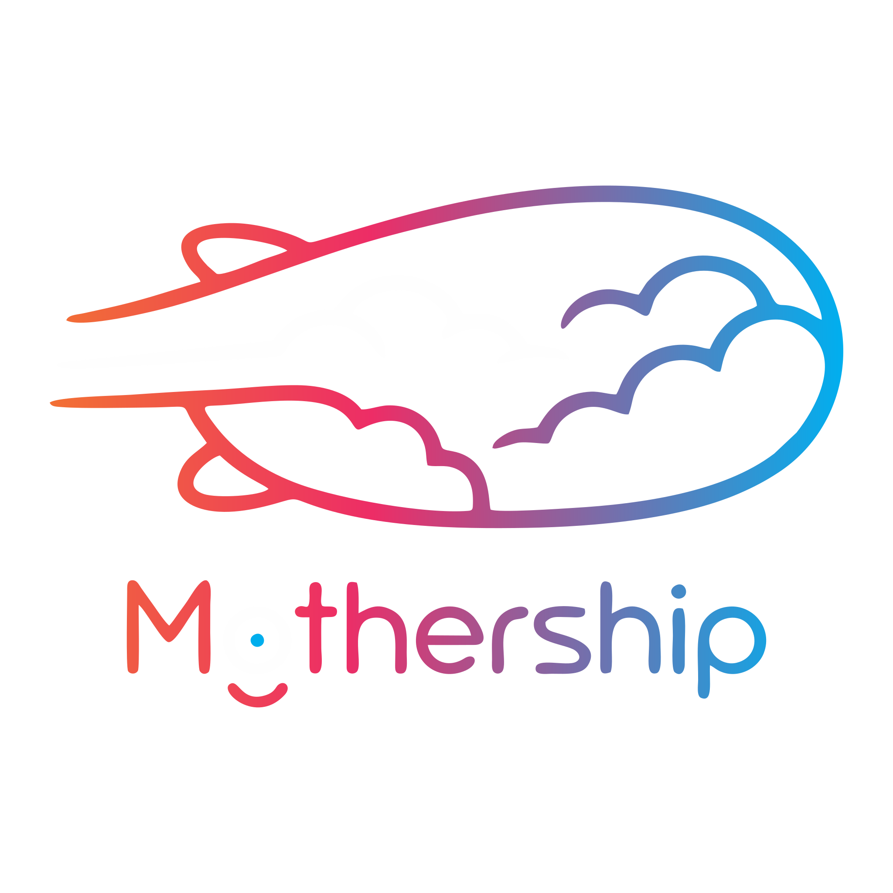
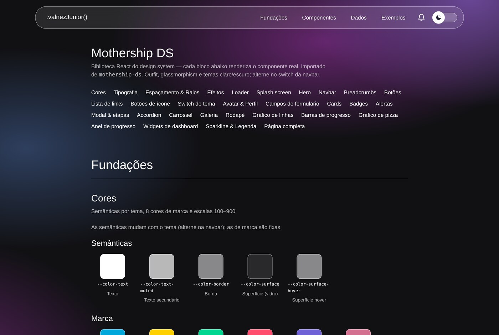
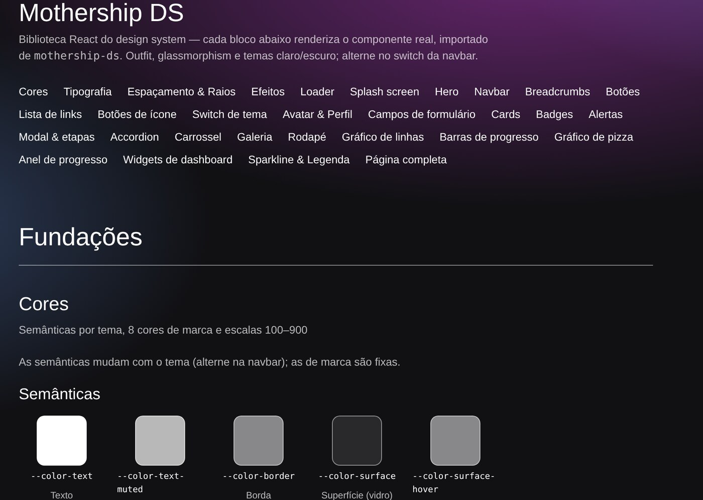
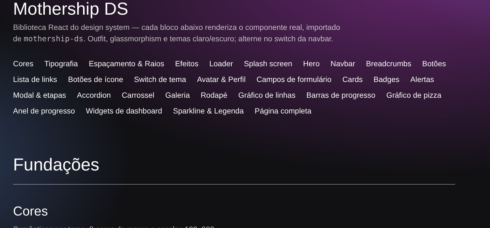
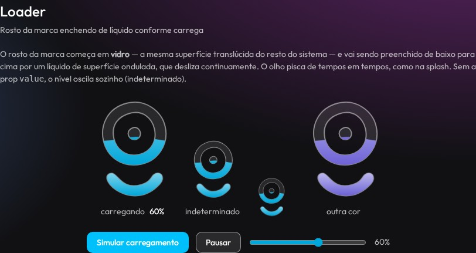
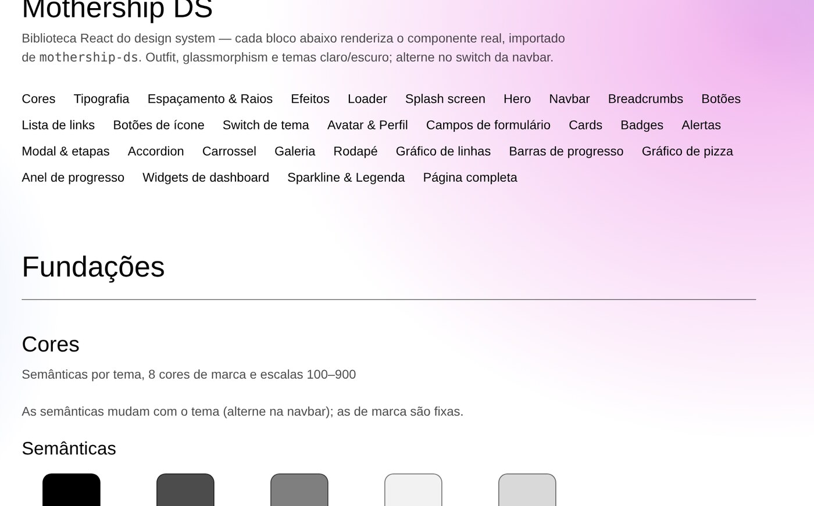
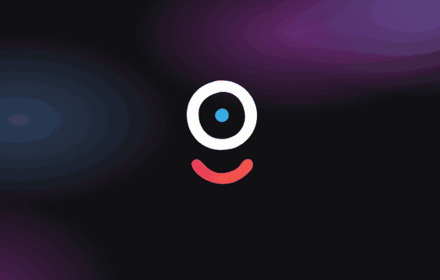

<div align="center">



# Mothership DS

**Design system em React + TypeScript** — glassmorphism, temas claro e escuro,
fundo animado e uma identidade de movimento própria.

[](https://github.com/valnezjr/mothership-ds/actions/workflows/ci.yml)
[](https://valnezjr.github.io/mothership-ds/)
[](LICENSE)


[**Ver o styleguide →**](https://valnezjr.github.io/mothership-ds/) ·
[**Ver a landing page de exemplo →**](https://valnezjr.github.io/mothership-ds/exemplo/)



</div>

---

## O que é

Uma biblioteca de componentes React nascida da engenharia reversa de uma
página pessoal em HTML/CSS puro. Os tokens — cores, tipografia,
espaçamento, o desfoque de vidro — foram extraídos do código original e
sistematizados; os componentes que faltavam foram construídos em cima
dessa mesma linguagem.

São **38 componentes**, do botão ao dashboard, todos em CSS e SVG puros:
sem dependência de runtime além do próprio React.

| | |
|---|---|
|  |  |
| Galeria com filtros e contorno reativo | Widgets de dashboard e gráficos |
|  |  |
| Loader enchendo de líquido | Tema claro |

<div align="center">

<br><em>Splash: o olho pisca enquanto carrega, o nome se centraliza a partir do O e o dirigível pousa por último.</em>
</div>

## Instalação

```bash
npm install github:valnezjr/mothership-ds
```

O pacote é distribuído como **código-fonte TypeScript** — sem etapa de
build. Isso preserva as diretivas `"use client"` intactas e evita as
armadilhas de empacotamento de bibliotecas React.

### Next.js (App Router)

Peça ao Next para transpilar o pacote:

```js
// next.config.js
module.exports = {
  transpilePackages: ["mothership-ds"],
};
```

Importe os estilos uma vez e monte os providers no layout raiz:

```tsx
// app/layout.tsx
import "mothership-ds/styles.css";
import {
  ThemeProvider,
  AlertsProvider,
  TooltipProvider,
  LivingBackground,
} from "mothership-ds";

export default function RootLayout({ children }: { children: React.ReactNode }) {
  return (
    <html lang="pt-br">
      <head>
        <link
          href="https://fonts.googleapis.com/css2?family=Outfit:wght@400;500&display=swap"
          rel="stylesheet"
        />
      </head>
      <body className="ms-page">
        <ThemeProvider>
          <AlertsProvider>
            <TooltipProvider>
              <LivingBackground />
              {children}
            </TooltipProvider>
          </AlertsProvider>
        </ThemeProvider>
      </body>
    </html>
  );
}
```

Há um exemplo completo de landing page em [`examples/next-app`](examples/next-app) —
[veja funcionando →](https://valnezjr.github.io/mothership-ds/exemplo/).

### Vite / React SPA

Mesma configuração, sem o `transpilePackages`. Monte os providers na raiz
da aplicação e aplique `className="ms-page"` no elemento que envolve tudo.

## Uso

```tsx
"use client";

import { Hero, HeroHighlight, ButtonLink, Badge, useAlerts } from "mothership-ds";

export default function Home() {
  const { notify } = useAlerts();

  return (
    <Hero
      eyebrow={<Badge tone="accent">Disponível para projetos</Badge>}
      title={<>Design que <HeroHighlight>flutua</HeroHighlight> sobre qualquer fundo</>}
      subtitle="Landing page construída com o Mothership DS."
      actions={
        <>
          <ButtonLink inline variant="solid" href="#projetos">Ver projetos</ButtonLink>
          <ButtonLink inline variant="ghost" href="#contato">Falar comigo</ButtonLink>
        </>
      }
    />
  );
}
```

## Componentes

<table>
<tr><td valign="top" width="33%">

**Layout e navegação**

`Page` · `Container` · `Navbar` · `Breadcrumbs` · `Hero` · `Footer`

**Marca**

`Splash` · `Loader` · `LogoMark`

</td><td valign="top" width="33%">

**Superfícies e controles**

`Button` · `ButtonLink` · `IconButton` · `LinkList` · `Card` · `Badge` ·
`Avatar` · `Profile` · `Field` · `Input` · `Textarea` · `ThemeSwitch`

**Interativos**

`Accordion` · `Carousel` · `Gallery` · `Marquee` · `Modal` · `StepModal` · `HoverEdge`

**Marketing**

`PricingCard` · `TestimonialCard` · `BentoGrid` · `BentoTile`

</td><td valign="top" width="33%">

**Alertas**

`Alert` · `AlertsProvider` · `useAlerts` · `NotificationBell`

**Dados**

`LineChart` · `Meter` · `PieChart` · `ProgressRing` · `Sparkline` ·
`StatGrid` · `StatTile` · `Legend` · `TooltipProvider` · `Table`

</td></tr>
</table>

A referência completa de props está em [`docs/componentes.md`](docs/componentes.md).

## Ícones

O sistema não embute uma biblioteca de ícones — não tem dependência de
runtime além do próprio React, e um conjunto de ícones é peso e opinião
demais pra impor a todo mundo. Os poucos ícones que a biblioteca usa
(seta do accordion, chevron do breadcrumb, X do modal…) são SVGs
inline, do mesmo jeito que qualquer ícone que você for passar como
`children`.

Pra ícones de produto (features, navegação, ações), a recomendação é
[**Lucide**](https://lucide.dev) (`lucide-react`, MIT). Traço de 2px
consistente em todos os ~1500 ícones — combina com a estética fina de
vidro do sistema — e cada ícone é importado à parte, então só o que
você usa entra no bundle.

```tsx
import { Check, ArrowRight } from "lucide-react";
import { Button, PricingCard } from "mothership-ds";

<PricingCard
  title="Pro"
  price="R$49"
  period="/mês"
  features={[{ text: <>Suporte prioritário <Check size={16} /></> }]}
  cta={<Button>Assinar <ArrowRight size={16} /></Button>}
/>
```

Qualquer ícone SVG funciona do mesmo jeito — `IconButton`, `Button` e
`PricingCard` só esperam `ReactNode`, nunca importam um ícone
específico por conta própria.

## Documentação

| Guia | Assunto |
|---|---|
| [Tokens](docs/tokens.md) | Cores, escalas, tipografia, espaçamento e efeitos |
| [Componentes](docs/componentes.md) | Referência de props, com exemplos |
| [Movimento](docs/movimento.md) | Fundo vivo, splash, loader e o easing do sistema |
| [Arquitetura](docs/arquitetura.md) | Decisões técnicas e por que cada uma foi tomada |
| [Contribuindo](CONTRIBUTING.md) | Como adicionar um componente ao sistema |

## Styleguide

O styleguide é **gerado a partir da própria biblioteca** — cada bloco
renderiza o componente real, importado de `src/`. Não existe um catálogo
paralelo que possa divergir do código.

```bash
npm run styleguide       # gera styleguide/dist/
npm run styleguide:dev   # servidor local com watch
```

Ele é publicado automaticamente no GitHub Pages a cada push na `master`.

## Princípios

**Tokens antes de valores.** Nenhum componente escreve `15px` ou
`#00afef`; tudo vem de variáveis CSS. É o que faz um componente novo
nascer coerente e funcionar nos dois temas sem trabalho extra.

**O movimento é parte da identidade.** Um único easing com overshoot
(`--ease-bounce`) assina as microinterações, e o fundo nunca fica
completamente parado. Tudo respeita `prefers-reduced-motion`.

**Acessibilidade não é opcional.** Estado marcado com `aria-*` e nunca só
com cor, foco visível em todos os controles, foco gerenciado no modal, e
as cores de dados validadas contra daltonismo (ΔE CVD ≥ 8) e contraste
(≥ 3:1) em cada tema.

**A biblioteca não invade o app.** Sem reset global, sem estilos fora de
`.ms-page`, sem dependências de runtime.

## Créditos

Marca, design e código por [Valnez Júnior](https://github.com/valnezjr) —
**Mothership Studios**. Tipografia [Outfit](https://fonts.google.com/specimen/Outfit).

Licença [MIT](LICENSE).
